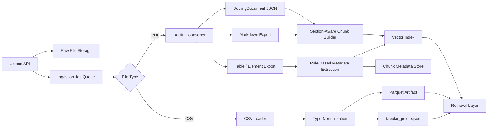

# Ingestion Architecture

## Scope

| Data type | Handling |
| --- | --- |
| PDF | `Docling` ingestion pipeline |
| CSV/XLSX | File-backed tabular ingestion for analysis agents |

## Persistence

| Layer | Technology |
| --- | --- |
| App metadata and chunk records | PostgreSQL |
| Chunk embeddings | `pgvector` on `document_chunks.embedding` |
| Tabular analysis artifacts | Parquet files on local storage |

## Upload Assumptions

| Field | Rule |
| --- | --- |
| `document_type` | Required: `project_description` or `progress_update` |
| `reporting_period` | Required only for `progress_update` |
| `reporting_period` format | `YYYY-MM` |

## High-Level Flow

## Processing Steps

| Step | PDF path | CSV/XLSX path |
| --- | --- | --- |
| 1. Upload | Store original PDF and create ingestion job | Store original CSV/XLSX and create ingestion job |
| 2. Parse | Use `Docling` to convert PDF into structured document output | Read file into pandas dataframe(s) |
| 3. Normalize | Export JSON/Markdown and preserve table/element structure | Normalize column names, nulls, and likely date columns |
| 4. Enrich | Add deterministic metadata such as `source_doc`, `reporting_month`, `section`, `contains_entities` | Build dataset profile with columns, dtypes, row counts, and sample rows |
| 5. Store | Save parsed artifacts and chunk metadata | Save normalized parquet plus `tabular_profile.json` artifacts |
| 6. Index | Build Jina embeddings from PDF `contextualized_text` and store them on `document_chunks` | Data analysis agent reads parquet artifacts on demand |

## PDF Design

| Decision | Choice |
| --- | --- |
| Parser | `Docling` |
| Default output kept | `DoclingDocument` JSON + Markdown |
| Chunking style | Section-aware, with table chunks kept separate from normal narrative chunks |
| Metadata source | Upload metadata (`document_type`, `reporting_period` when applicable) + document structure + regex/entity rules |
| LLM in critical path | No |
| OCR path | Optional later, only if scanned PDFs become common |

## CSV/XLSX Design

| Decision | Choice |
| --- | --- |
| Parser | Pandas-based loader |
| Storage | File-backed parquet artifacts |
| Output | One normalized parquet per dataset or worksheet plus shared profile JSON |
| Query path | Data analysis agent reads artifacts directly, not PDF-style vector retrieval |

## Stored Outputs

| Artifact | Purpose |
| --- | --- |
| Raw file | Auditability and reprocessing |
| `DoclingDocument` JSON | Canonical structured parse of the PDF |
| Markdown export | Simple downstream chunking and debugging |
| `document_context.json` | Document-level metadata inherited by PDF chunks |
| `chunks.json` | Retrieval-ready PDF chunk records with raw and contextualized text |
| Table/element exports | Preserve milestone, dashboard, and financial table structure |
| Chunk metadata | Citation, provenance, and entity linking |
| Normalized parquet datasets | Typed tabular input for analysis agents |
| `tabular_profile.json` | Schema, sample rows, and dataset summary for uploaded spreadsheets |

## Retrieval Contract

| Question type | Source |
| --- | --- |
| Narrative or cross-report reasoning | PDF chunks from vector retrieval |
| Numeric / tabular / filtering | CSV/XLSX parquet artifacts via analysis agent |
| Mixed questions | Retrieve from both and synthesize in the answer layer |

## Current Rationale

| Choice | Why |
| --- | --- |
| `Docling` for PDF | Best match for structured project reports with headings and a few critical tables |
| File-backed handling for CSV/XLSX | Keeps tabular ingestion flexible without forcing every new spreadsheet into a fixed database schema |
| PostgreSQL + `pgvector` | Keeps metadata and future embeddings in one system instead of introducing a second dedicated vector database too early |
| No LLM-first ingestion | Deterministic parsing is easier to validate and debug for the current dataset |
