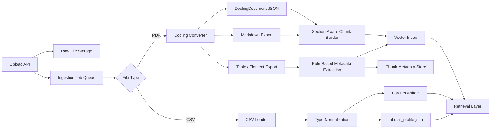
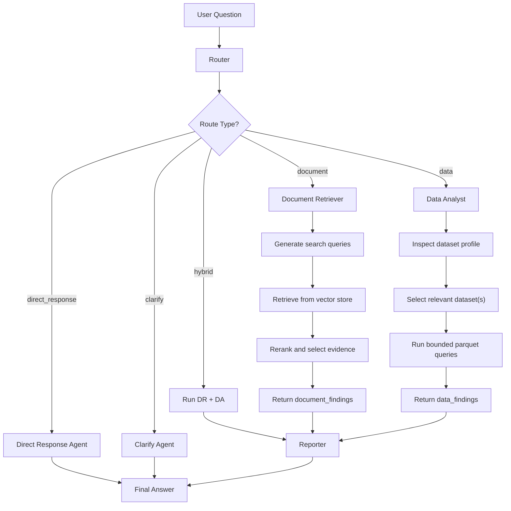

# Ingestion Architecture

## Scope

| Data type | Handling |
| --- | --- |
| PDF | `Docling` ingestion pipeline |
| CSV/XLSX | File-backed tabular ingestion for analysis agents |

## Persistence

| Layer | Technology |
| --- | --- |
| App metadata and chunk records | PostgreSQL |
| Chunk embeddings | `pgvector` on `document_chunks.embedding` |
| Tabular analysis artifacts | Parquet files on local storage |

## Upload Assumptions

| Field | Rule |
| --- | --- |
| `document_type` | Required: `project_description` or `progress_update` |
| `reporting_period` | Required only for `progress_update` |
| `reporting_period` format | `YYYY-MM` |

## High-Level Flow



## Processing Steps

| Step | PDF path | CSV/XLSX path |
| --- | --- | --- |
| 1. Upload | Store original PDF and create ingestion job | Store original CSV/XLSX and create ingestion job |
| 2. Parse | Use `Docling` to convert PDF into structured document output | Read file into pandas dataframe(s) |
| 3. Normalize | Export JSON/Markdown and preserve table/element structure | Normalize column names, nulls, and likely date columns |
| 4. Enrich | Add deterministic metadata such as `source_doc`, `reporting_month`, `section`, `contains_entities` | Build dataset profile with columns, dtypes, row counts, and sample rows |
| 5. Store | Save parsed artifacts and chunk metadata | Save normalized parquet plus `tabular_profile.json` artifacts |
| 6. Index | Build Jina embeddings from PDF `contextualized_text` and store them on `document_chunks` | Data analysis agent reads parquet artifacts on demand |

## PDF Design

| Decision | Choice |
| --- | --- |
| Parser | `Docling` |
| Default output kept | `DoclingDocument` JSON + Markdown |
| Chunking style | Section-aware, with table chunks kept separate from normal narrative chunks |
| Metadata source | Upload metadata (`document_type`, `reporting_period` when applicable) + document structure + regex/entity rules |

## CSV/XLSX Design

| Decision | Choice |
| --- | --- |
| Parser | Pandas-based loader |
| Storage | File-backed parquet artifacts |
| Output | One normalized parquet per dataset or worksheet plus shared profile JSON |
| Query path | Data analysis agent reads artifacts directly, not PDF-style vector retrieval |

## Stored Outputs

| Artifact | Purpose |
| --- | --- |
| Raw file | Auditability and reprocessing |
| `DoclingDocument` JSON | Canonical structured parse of the PDF |
| Markdown export | Simple downstream chunking and debugging |
| `document_context.json` | Document-level metadata inherited by PDF chunks |
| `chunks.json` | Retrieval-ready PDF chunk records with raw and contextualized text |
| Table/element exports | Preserve milestone, dashboard, and financial table structure |
| Chunk metadata | Citation, provenance, and entity linking |
| Normalized parquet datasets | Typed tabular input for analysis agents |
| `tabular_profile.json` | Schema, sample rows, and dataset summary for uploaded spreadsheets |

## Retrieval Contract

| Question type | Source |
| --- | --- |
| Narrative or cross-report reasoning | PDF chunks from vector retrieval |
| Numeric / tabular / filtering | CSV/XLSX parquet artifacts via analysis agent |
| Mixed questions | Retrieve from both and synthesize in the answer layer |

## Multi-Agent RAG Flow

The answer layer is designed as a small LangGraph-based workflow where each new user turn is rerouted. Lightweight conversational follow-ups can be answered directly, while evidence-heavy questions still go through retrieval and synthesis.



## Agent Roles

| Agent | Responsibility |
| --- | --- |
| `Router` | Classifies each user turn into `direct_response`, `clarify`, `document`, `data`, or `hybrid` so follow-up questions can be rerouted appropriately. |
| `Direct Response Agent` | Answers lightweight conversational turns from existing chat context when no new retrieval or structured analysis is needed. |
| `Clarify Agent` | Asks one short clarifying question when the user request is too vague to answer responsibly. |
| `Document Retriever` | Expands the question into multiple search queries, retrieves and reranks vector results, and returns cited document findings. |
| `Data Analyst` | Inspects dataset metadata, runs bounded parquet-based analysis, and returns cited data findings. |
| `Reporter` | Reads the user question together with all returned findings and produces the final grounded answer for retrieval-backed routes. |

## Context Management

The shared orchestration state stays intentionally small so retries, tool traces, and intermediate failures from specialized agents do not pollute the main answer context.

### Shared State

```json
{
  "messages": [],
  "route": "hybrid",
  "document_findings": [],
  "data_findings": [],
  "needs_clarification": false,
  "final_answer": null
}
```

### Finding Contract

Each specialized agent writes back only normalized findings, not its internal scratchpad.

```json
{
  "findings": [
    {
      "claim": "Cheras North utility diversion slipped from March to 18 Apr 2026",
      "evidence": [
        {
          "source": "monthly_status_report_feb_2026",
          "citation": "doc_id/chunk_id or page/section",
          "snippet": "Expected completion in March subject to authority clearance"
        },
        {
          "source": "executive_steering_update_mar_2026",
          "citation": "doc_id/chunk_id or page/section",
          "snippet": "Forecast completion moved to 18 Apr 2026"
        }
      ]
    }
  ]
}
```

### Scratchpad Rule

Each specialized agent can keep private scratchpad state for search attempts, retries, temporary tool outputs, and execution errors, but only final findings are promoted into shared state for the `Reporter`.

## Follow-Up Query Handling

Follow-up questions are not hardcoded to one response mode. Every new user turn is rerouted again using the full thread message history already stored in graph state.

| Follow-up type | Expected route |
| --- | --- |
| Greeting, memory check, simple formatting, or conversational continuation | `direct_response` |
| Underspecified request that needs one more detail | `clarify` |
| Follow-up asking for report evidence or narrative support | `document` |
| Follow-up asking for numeric comparison or dataset-backed analysis | `data` |
| Follow-up needing both cited reports and structured analysis | `hybrid` |

This keeps the system flexible: a later query can still trigger a fresh evidence workflow instead of being forced into a direct-answer path.

## Current Rationale

| Choice | Why |
| --- | --- |
| `Docling` for PDF | Best match for structured project reports with headings and a few critical tables |
| File-backed handling for CSV/XLSX | Keeps tabular ingestion flexible without forcing every new spreadsheet into a fixed database schema |
| PostgreSQL + `pgvector` | Keeps metadata and future embeddings in one system instead of introducing a second dedicated vector database too early |
| No LLM-first ingestion | Deterministic parsing is easier to validate and debug for the current dataset |
