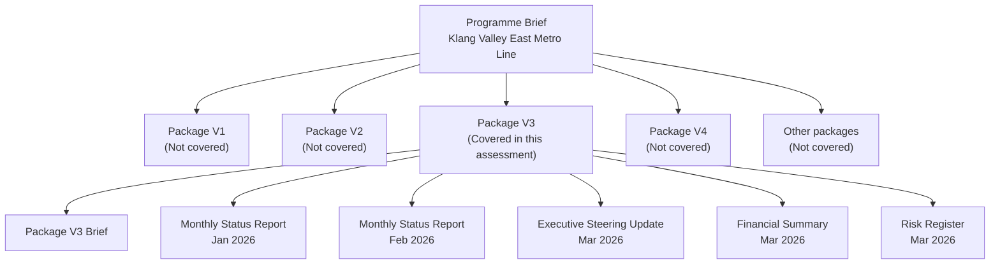

# Data Overview

## Purpose

This directory contains the project documents prepared for the `AI-Powered Project Intelligence Assistant` take-home assessment.

The data is structured to support three activities:

1. preparing and refining the project narrative
2. running RAG over a realistic project document set
3. evaluating question-answer performance against a defined test set

The document set is intentionally scoped to `Package V3` of the broader `Klang Valley East Metro Line` programme. The assistant is therefore expected to answer package-level questions, while still using programme-level briefs as context when needed.

## Scope

The overall metro line is larger than the document set used for retrieval. For this assessment:

- `Programme Brief` provides line-wide context
- `Package V3 Brief` defines the baseline package scope, milestones, and commercial plan
- monthly reporting, cost data, and risk data are focused on `Package V3`

The retrieval scope is therefore intentionally narrower than the full programme. This reflects how real project reporting is often organised in production environments.

## Directory Structure

```text
data/
├── evaluation/
│   └── RAGAS_TEST_CASES.md
├── preparation/
│   ├── PROGRAMME_BRIEF.md
│   ├── PACKAGE_V3_BRIEF.md
│   ├── monthly_status_report_jan_2026.md
│   ├── monthly_status_report_feb_2026.md
│   ├── executive_steering_update_mar_2026.md
│   └── corresponding HTML preview files
└── synthetic-data/
    ├── Programme Brief.pdf
    ├── Package V3 Brief.pdf
    ├── Monthly Status Report Jan 2026.pdf
    ├── Monthly Status Report Feb 2026.pdf
    ├── Executive Steering Update Mar 2026.pdf
    ├── financial_summary_mar_2026.csv
    └── risk_register_mar_2026.csv
```

## High-Level Data Structure



## What Is Included

### 1. Preparation Documents

These are editable source documents used to shape the project narrative and maintain consistency before generating the final RAG inputs.

Included:

- line-wide programme context
- package-level scope and baseline
- monthly reporting narrative for January, February, and March 2026
- HTML previews for fast review and PDF export

### 2. Synthetic Data Used For RAG

These are the packaged documents intended for ingestion by the assistant.

Included:

- `Programme Brief.pdf`
- `Package V3 Brief.pdf`
- `Monthly Status Report Jan 2026.pdf`
- `Monthly Status Report Feb 2026.pdf`
- `Executive Steering Update Mar 2026.pdf`
- `financial_summary_mar_2026.csv`
- `risk_register_mar_2026.csv`

This set gives the system:

- narrative documents
- structured commercial data
- structured risk data
- baseline context and reporting-period evidence

### 3. Evaluation Assets

The `evaluation/` directory currently contains the first pass of the RAGAS test set.

Included:

- `RAGAS_TEST_CASES.md`

This file defines:

- evaluation questions
- difficulty levels
- expected answer direction
- expected evidence sources

## Why The Data Focuses On Package V3

The East Metro Line is modelled as a multi-package programme. The assistant does **not** attempt to answer the entire programme in equal detail. Instead, it is tested primarily on `Package V3`, which covers:

- an elevated viaduct section
- `Pandan Gateway Station`
- `Cheras North Station`
- utility and traffic interfaces
- systems access and interface dependencies

This narrower scope makes the dataset more realistic and easier to evaluate. In real delivery environments, monthly performance, risk, and cost control are often managed and reported at package level rather than only at whole-programme level.

## Messy / Inconsistent Data Included

The dataset includes controlled inconsistencies intended to reflect real-world reporting conditions:

- timeline drift between planned and latest-forecast milestones
  Example: utility diversion was still expected in March in February reporting, but slipped into April in the March executive update
- partial disagreement between narrative status and control status
  Example: `NCR-014` was reported closed by site, while independent QA verification remained pending
- naming variation by reporting context
  Example: `Cheras North Station`, `Cheras North corridor`, and room/access references in different documents
- incomplete structured data
  Example: one blank `owner` field in the risk register
- mixed date formats in structured data
- package-level narrative and commercial evidence spread across multiple documents rather than one perfect source

These inconsistencies are intentional enough to test retrieval and answer quality, but limited enough that the data remains explainable and internally manageable.

## What This Dataset Does Not Include

This dataset is intentionally scoped and does not attempt to simulate every data source that might exist in production.

Not included:

- design drawings and CAD/BIM files
- email threads and meeting minutes
- procurement logs and subcontract agreements
- GIS or utility survey layers
- scanned handwritten site records
- image attachments and inspection photos
- daily site diaries
- full line-wide reporting for all packages

This means the assistant is being tested on a realistic but bounded subset of project intelligence data rather than a full enterprise document estate.

## Notes On Production Realism

The dataset is designed to be realistic in structure, but not exhaustive in volume.

It is intended to demonstrate:

- multi-document reasoning
- package-level retrieval with programme-level context
- source citation across narrative and tabular data
- handling of minor inconsistencies and incomplete fields

It is not intended to represent:

- a complete project controls environment
- every possible reporting artifact used in a live rail programme
- every package in the East Metro Line

## Evaluation Note

The current RAGAS test file references logical source documents by document name. If the evaluation is automated later against the ingested PDFs and CSVs, these references can be mapped directly to the files under `synthetic-data/`.
